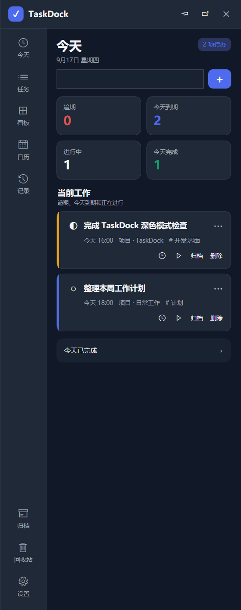
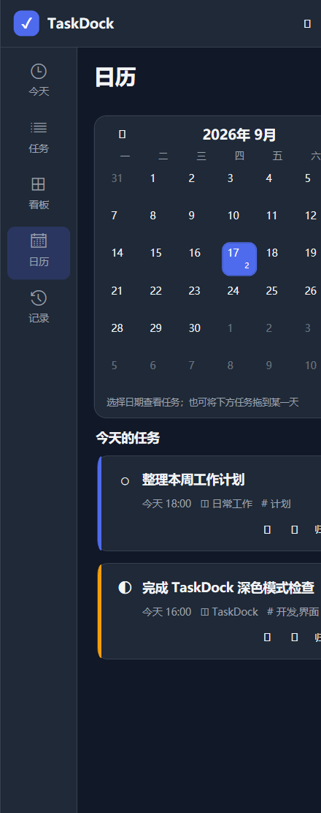
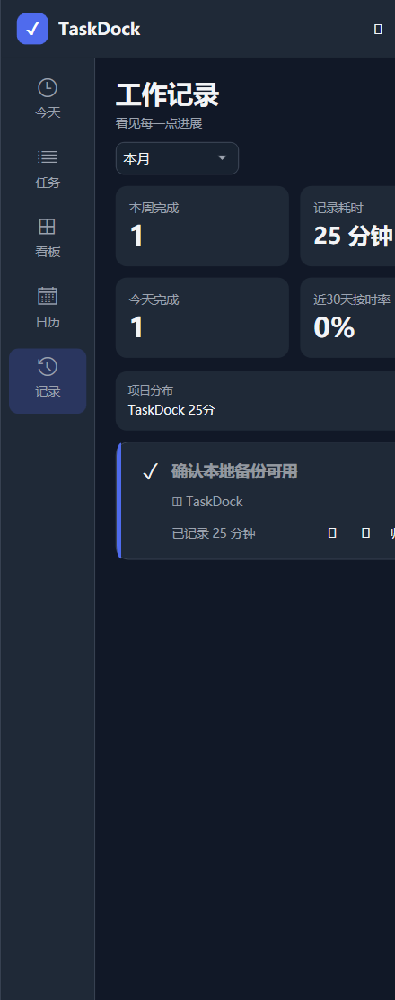

# TaskDock

TaskDock 是一款完全本地运行的 Windows 10/11 边缘待办工具。它可以吸附在屏幕左侧、右侧、顶部或底部；鼠标触碰所选边缘，或按下全局快捷键，即可快速查看当前工作。

无需账号、无需联网，不发送遥测，也不会把任务和附件上传到云端。

## 界面预览

| 今日总览 | 日历安排 | 工作记录 |
| --- | --- | --- |
|  |  |  |

## 主要功能

- 待处理、进行中、已完成三阶段任务流
- 左侧、右侧、顶部、底部吸附与鼠标触边滑出
- 全局快捷键（默认 Ctrl + Alt + T）、固定展开和普通窗口模式
- 中文自然语言快速创建，例如“明天下午 3 点提交周报，提前 30 分钟提醒”
- 精确到分钟的截止时间和 Windows 通知提醒
- 项目、标签、优先级、备注、重复任务及预计耗时
- 可勾选子任务，以及任务卡片上的完成进度
- 备注网页、独立网页链接和本地附件快捷打开
- 可拖动的三阶段看板与月历排期
- 按秒累计的任务计时、完成率和工作记录
- SQLite 本地数据、备份恢复及 JSON/CSV/Markdown 导入导出
- 浅色、深色和跟随系统主题

## 下载与安装

前往 [Releases](https://github.com/zhuweihangjlu-prog/TaskDock/releases) 下载最新版本：

- TaskDock-Setup-0.2.0-win-x64.exe：安装版，适合长期使用。
- TaskDock-Portable-0.2.0-win-x64.zip：便携版，解压后直接运行 TaskDock.exe。

首次启动时可以选择是否开机启动，之后也能在“设置”页面修改。

## 快速使用

### 1. 呼出和隐藏 TaskDock

- 默认吸附在屏幕右侧，把鼠标移动到屏幕最右边即可滑出。
- 按 Ctrl + Alt + T 可以随时呼出或收起。
- 点击标题栏的图钉可保持展开。
- 点击浮动按钮可切换为普通窗口。
- 在“设置 → 呼出方式 → 自动弹出位置”中，可以改为左侧、顶部或底部。
- 多显示器用户可以在同一区域选择 TaskDock 吸附的显示器。

### 2. 创建任务

在“今天”页面顶部输入任务，然后点击加号或按 Enter。

快速输入支持常见中文时间表达：

    明天下午3点提交周报
    周五18点整理工作计划，提前30分钟提醒
    每天9点查看项目进度

需要填写更多信息时，使用“新建任务”或任务卡片右上角的编辑按钮。

### 3. 设置截止时间与提醒

任务编辑器中的截止时间和提醒时间都由“日期 + 时间”组成，时间可以精确到分钟。

- 日期格式：yyyy-MM-dd
- 时间格式：HH:mm
- 可直接选择“今天 18:00”或“明天 18:00”
- 提醒可快速设为“截止前 15 分钟”或“截止前 1 小时”

到达提醒时间后，TaskDock 会通过 Windows 通知提示。

### 4. 使用子任务

子任务用于把较大的工作拆成若干可以独立勾选的步骤。例如：

    准备数据
    编写初稿
    检查并提交

保存后，任务卡片会显示类似“子任务 2/3”的完成进度。再次打开编辑器即可继续勾选、修改或删除步骤。

### 5. 备注、链接与本地附件

- **备注**：记录任务背景和详细说明。备注中包含 http:// 或 https:// 地址时，可以点击“打开备注中的网页”访问第一个地址。
- **网页链接**：用于单独关联需求页面、在线文档或参考资料。保存后任务卡片会显示“链接”入口。
- **本地附件**：用于关联电脑上的文档、图片或其他文件。TaskDock 只保存文件路径，不复制或上传原文件；移动或删除原文件后，该入口会失效。

### 6. 推进任务状态

- 点击任务卡片左侧状态图标，可依次切换“待处理 → 进行中 → 已完成”。
- 在“看板”页面，可以直接把任务拖到其他状态区域。
- 看板中的三个列表可以分别折叠，减少界面占用。

### 7. 使用日历

- 日历中的数字表示当天任务数量。
- 点击日期可查看当天任务。
- 可以把下方任务拖到新的日期，快速修改截止日。

### 8. 任务计时与工作记录

点击任务卡片上的计时按钮开始记录，重复点击可暂停。计时按秒累计；同一时间只会有一个任务处于计时状态。

“记录”页面会汇总：

- 今天和本周完成的任务数量
- 已记录的工作时长
- 近 30 天按时完成率
- 按项目统计的工作分布

### 9. 归档、回收站与数据备份

- 完成后仍需保留但不想继续显示的任务，可以移入“归档”。
- 删除的任务进入“回收站”，可以恢复或彻底删除。
- 在“设置 → 本地数据”中可以备份、恢复、导入和导出数据。

## 本地数据位置

- 安装版：%LOCALAPPDATA%\TaskDock
- 便携版：程序目录下的 Data 文件夹

建议定期使用“立即备份”，并把备份文件保存到其他磁盘。

## 从源码构建

需要 Windows 10/11 与 .NET 8 SDK：

    dotnet restore TaskDock.sln
    dotnet build TaskDock.sln -c Release
    dotnet test TaskDock.sln -c Release

发布 Windows x64 自包含版本：

    dotnet publish src\TaskDock\TaskDock.csproj -c Release -r win-x64 --self-contained true -p:PublishSingleFile=true -p:IncludeNativeLibrariesForSelfExtract=true

## 项目结构

- src/TaskDock：WPF 应用、SQLite 数据层与 Windows 系统集成
- tests/TaskDock.Tests：解析、资源链接、屏幕边缘和数据持久化测试
- installer/TaskDock.iss：Inno Setup 安装脚本
- docs/images：README 界面截图
- tools/GenerateIcon.ps1：应用图标生成脚本

## 许可

当前版本主要面向个人本地使用。若需要分发、二次开发或补充正式开源许可证，请先查看仓库中的最新说明。
